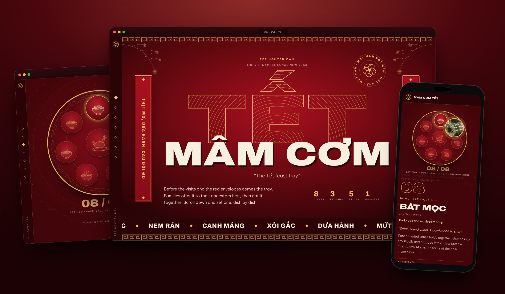
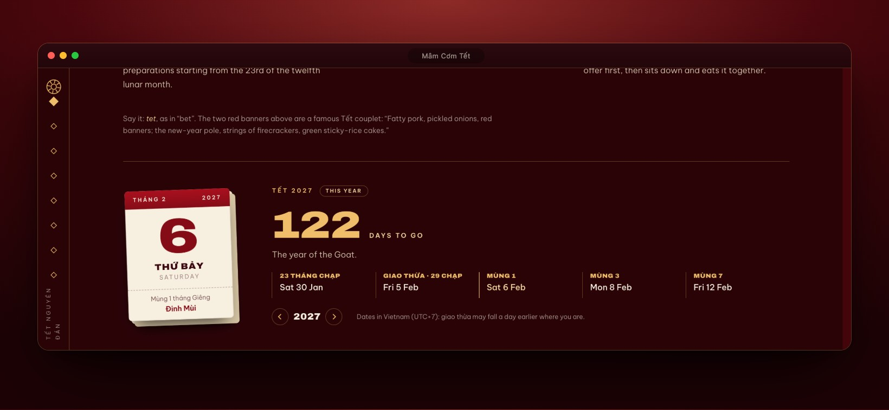
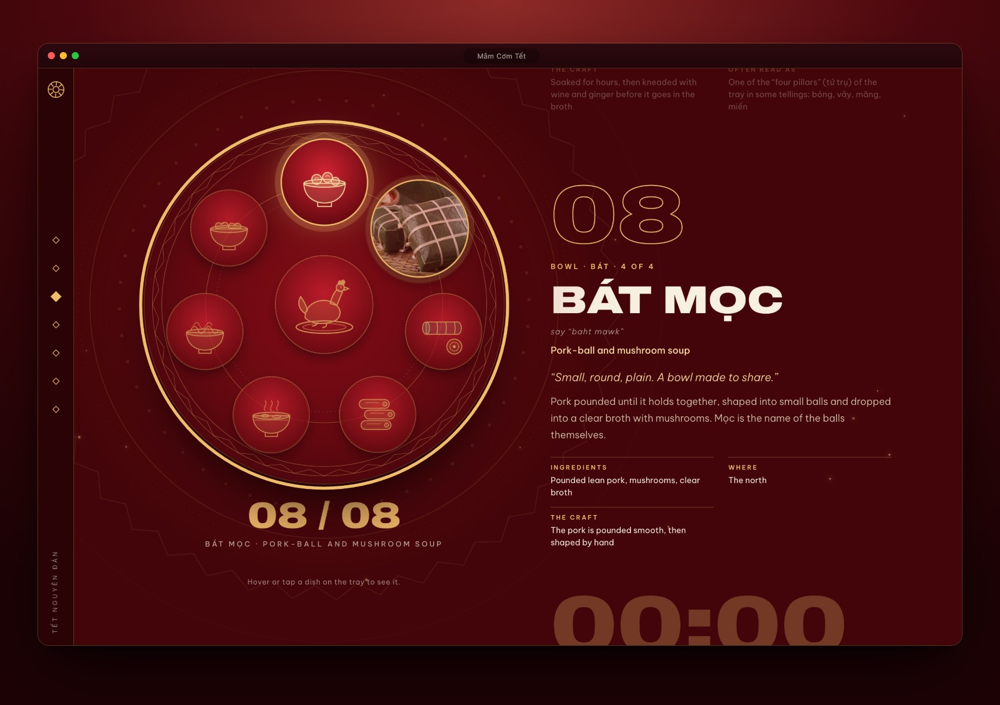
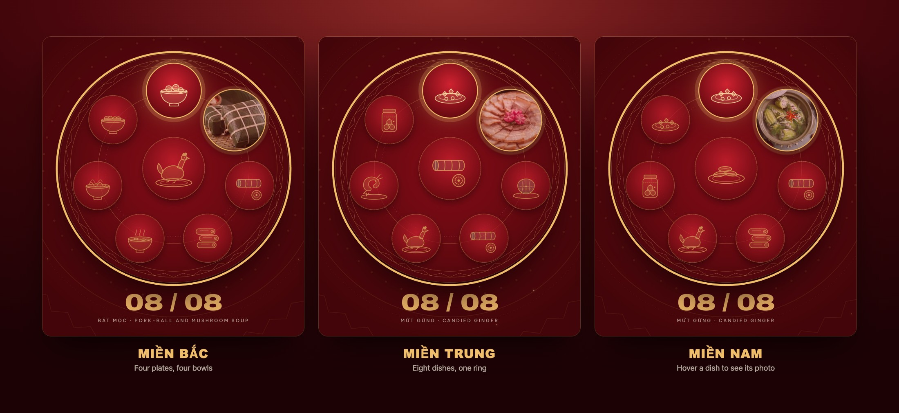
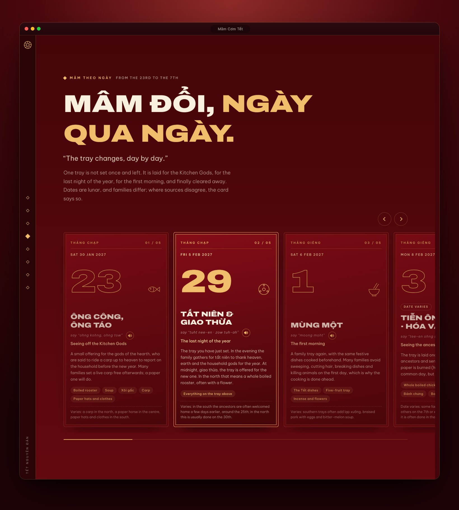
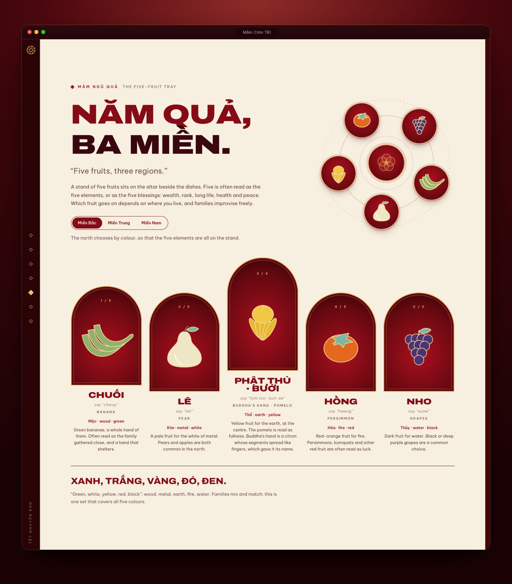
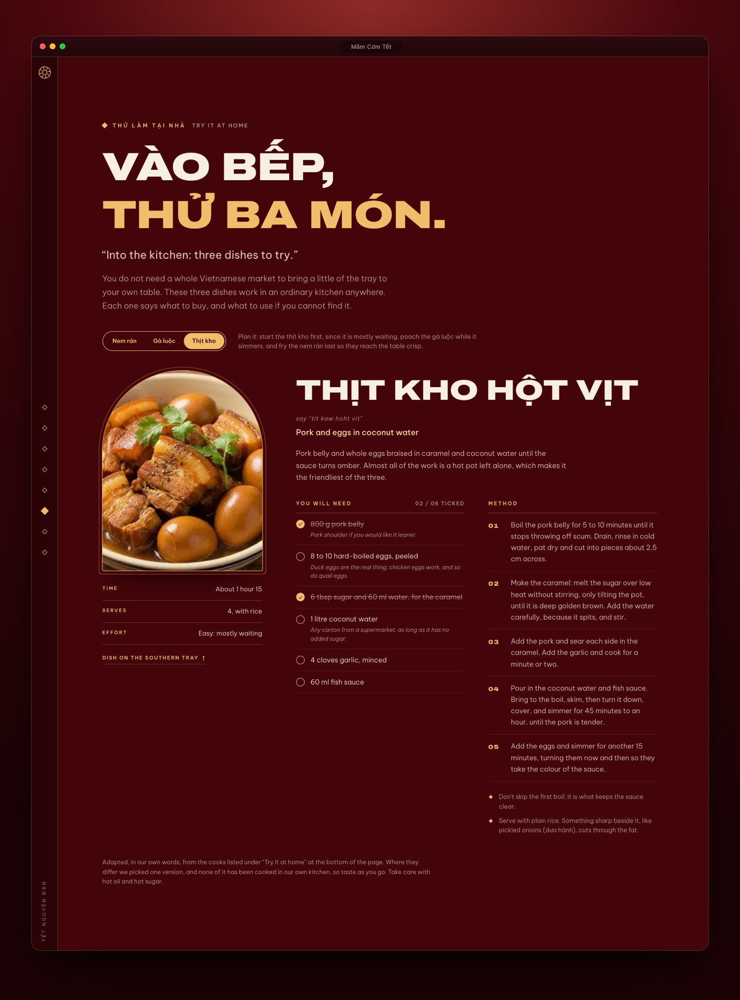
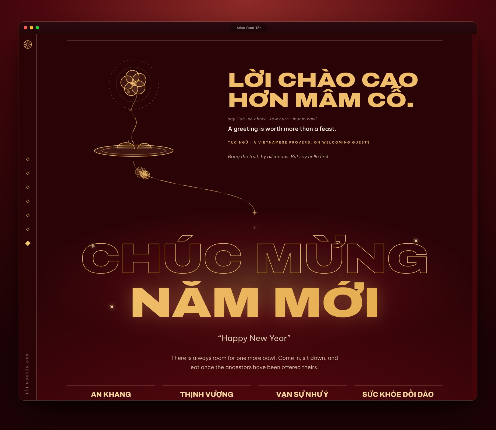
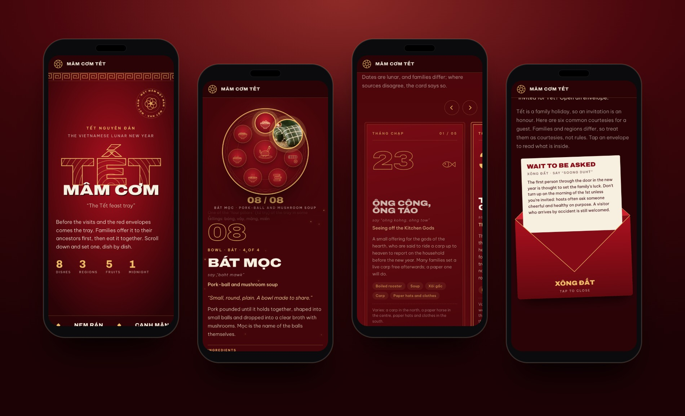

<div align="center">

# Mâm Cơm Tết

**An illustrated guide to the Vietnamese new-year feast tray.**
When Tết falls and how long to wait, eight dishes set one at a time, a tray that changes from the 23rd to the 7th, five fruits, three dishes to cook at home, and what to know if you are invited.

<br />



<br />
<br />


</div>

---

## About

Tết is the Vietnamese Lunar New Year, and the feast tray (*mâm cơm*) sits at the middle of it. This site walks through that tray the way a family lays it: one dish at a time, then day by day, then fruit by fruit, then a few courtesies for the guest who is invited to the table.

It is a single scrolling page. Everything is drawn in a lacquer-red and gold line style, headlines are in Vietnamese with English beneath, and every word comes with an approximate pronunciation (*say “ohng kohng”*).

## Highlights

- **When is Tết?** A small tear-off calendar gives the day Tết begins on the Gregorian calendar, the days left, and the name of the year (Đinh Mùi, the Goat). Step to any year from 1976 to 2100.
- **A tray that sets itself.** A sticky tray on the left fills dish by dish while you scroll the steps on the right. The ring of dishes turns like a lazy Susan, so the dish being set always drops in at the top.
- **Dishes that turn into photos.** Hover, focus or tap a plate and its line drawing gives way to a real photo, right on the plate.
- **Three regional trays.** North, centre and south each lay eight dishes in their own way; one toggle swaps the whole tray.
- **A day-by-day carousel.** Five cards from the 23rd of the twelfth lunar month to the 7th, each with its real date for the year being shown. Drag it, swipe it, use the arrows or the arrow keys, or click a card to bring it forward.
- **The five-fruit tray, by region.** The north chooses by colour, the south by what the names sound like, and the centre often just offers what it has.
- **Three dishes to cook at home.** Nem rán, gà luộc and thịt kho, each with what to buy abroad and what to use if you cannot find it. Tick ingredients off as a shopping list.
- **Hear it said.** A small speaker button sits beside the pronunciation of every dish, fruit, day and wish, and plays the Vietnamese with its tones, which spelling it out in English letters cannot do.
- **Six envelopes of etiquette.** Tap a red envelope to read what to bring, what to say and how to take a *lì xì*.
- **A thread from the proverb to the greeting.** A gold thread carries blossoms from *“Lời chào cao hơn mâm cỗ”* down to *“Chúc mừng năm mới”*.
- **Honest about what it knows.** Dates are lunar and families differ, so cards say *“Date varies”* where sources disagree, italic lines are marked as the page's own telling, and every source is listed at the bottom.

## Screenshots

### When is Tết?

A tear-off calendar for the next Tết, the days around it, and a year to step through.



### The tray, set dish by dish

Scroll and the tray fills; hover a plate and it becomes its photo.



### One tray, three regions

Each region sets eight dishes in its own way.



### Day by day

The tray changes from the 23rd to the 7th, and each card shows its date on the Gregorian calendar. The card for the last night of the year is lit by default, and shows the 29th or the 30th depending on the year.



### The five fruits



### Try it at home

Three dishes from the tray, written for a kitchen far from a Vietnamese market. Ingredients can be ticked off, and each says what to swap.



### If you are invited


### From a proverb to a greeting



### On a phone

The tray shrinks into a pinned strip at the top while the steps scroll underneath, and a side rail becomes a top bar.



## Tech stack

| | |
|---|---|
| Framework | [Next.js 16](https://nextjs.org) (App Router) with React 19 |
| Language | TypeScript 5 |
| Styling | Hand-written CSS Modules, one per component, on a small set of colour tokens in `globals.css` (Tailwind CSS 4 is imported there, but no utility classes are used) |
| Type | [Archivo](https://fonts.google.com/specimen/Archivo) (width axis for the extended display type) and [Be Vietnam Pro](https://fonts.google.com/specimen/Be+Vietnam+Pro), loaded with `next/font` |
| Art | Hand-built SVG for dishes, fruits, blossoms and incense, plus dish photos in `public/img` |
| Package manager | pnpm |

There are no runtime dependencies beyond Next.js and React. Every carousel, observer and animation is written in this repository.

## Getting started

You need Node.js 20.9 or newer and [pnpm](https://pnpm.io). (`pnpm audio` needs Node.js 22.18 or newer, because it reads the TypeScript data files directly.)

```bash
pnpm install
pnpm dev
```

Then open [http://localhost:3000](http://localhost:3000).

| Command | What it does |
|---|---|
| `pnpm dev` | Start the dev server |
| `pnpm build` | Build for production |
| `pnpm start` | Serve the production build |
| `pnpm lint` | Run ESLint |
| `pnpm audio` | Make the pronunciation recordings that are missing (macOS only, see below) |

## Project structure

Each section of the page is a folder under `app/_components`, with its content kept in a `data.ts` beside the component.

```text
app/
├── page.tsx                 # the page: sections in order
├── layout.tsx               # fonts, metadata, preloader, side rail
├── globals.css              # colour tokens and shared furniture
├── opengraph-image.png      # social preview
└── _components/
    ├── hero/                # poster, couplets, blossom branches
    ├── primer/              # "What is Tết?"
    ├── setting/             # the sticky tray, incense and embers
    ├── dishes/              # dish data, SVG sprite and drawings
    ├── days/                # the day-by-day carousel
    ├── fruits/              # the five-fruit tray and its orbit
    ├── recipes/             # "Try it at home": three dishes to cook
    ├── speech/              # the speaker button and the file names it plays
    ├── tet/                 # the lunar calendar (lunar.ts), the shared year, the countdown
    ├── guest/               # the six envelopes
    ├── proverb/             # proverb figures, the thread to the greeting
    ├── closer/              # the greeting, wishes and sources
    ├── rail/                # section navigation
    ├── preloader/           # loading screen
    └── ui/                  # shared headings and the region toggle
```

`public/audio/vi/` holds the pronunciation recordings, and `scripts/generate-audio.mjs` makes them.

`app/_components/days/steps/` holds `Step1` to `Step8`: the day-by-day carousel rebuilt one idea at a time, from plain cards to drag-to-scroll. They are rendered by `app/_learn`, a private folder that does not create a route. Rename it to `app/learn` to browse them at `/learn/days`.

## Pronunciation audio

Each speaker button plays a short recording from `public/audio/vi/`. If a recording is missing or will not load, it falls back to the browser's own Vietnamese voice, and if the browser has none the button says so instead of reading Vietnamese with the wrong sounds.

The recordings are made by the macOS Vietnamese voice *Linh*, with `pnpm audio` (it only makes what is missing; `pnpm audio --force` makes everything again). They are **machine voices, not a person**, and they have not been checked by a native speaker. To use a real recording, save it as `.m4a` under the same file name in `public/audio/vi/`: the page plays that file with no code change. Check that the licence of the voice you use allows publishing its audio.

## Accessibility

- The main interactions work from the keyboard: the carousel takes ← and →, plates take focus and show their photo, envelopes are real buttons.
- Motion respects `prefers-reduced-motion`: the ring stops turning, blossoms and sparks stand still, and the carousel and page scrolling jump instead of gliding.
- The countdown announces its number politely when it changes, and its year stepper is two labelled buttons.
- Vietnamese and English text carry `lang` attributes so screen readers pick the right voice.
- Decorative art is hidden from assistive technology; photos and controls are labelled, and each speaker button names the word it plays.

## About the content

The recipes are adapted, in our own words, from the cooks listed under **Try it at home** at the bottom of the page. Where they differ we picked one version, and none of them has been cooked in our own kitchen.

The Tết dates come from our own working of the Vietnamese lunar calendar (`app/_components/tet/lunar.ts`), done for UTC+7, and not from the browser's built-in Chinese calendar: the two can disagree, as they do for 2027. The dates shown are the ones in Vietnam, so where you are, giao thừa can fall on the day before. The countdown counts from your own calendar date, and shows next year's Tết once the 7th day of this one has passed. The results were checked against published Vietnamese dates for 2024 to 2032 and against the famous 1985 case, when Tết fell on 21 January in Vietnam and 20 February in China. Other years have not been checked by hand.

This page is a sketch, not a rulebook. Customs differ by family and region, the English-language sources are mostly travel guides, and the italic lines are our own telling rather than tradition. The text was written from mostly Vietnamese press; the full list is under **Where this comes from** at the bottom of the page. If something does not match your home, trust your home.

## Credits

Design and build by **Gnoud**.
